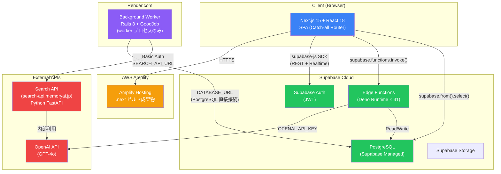
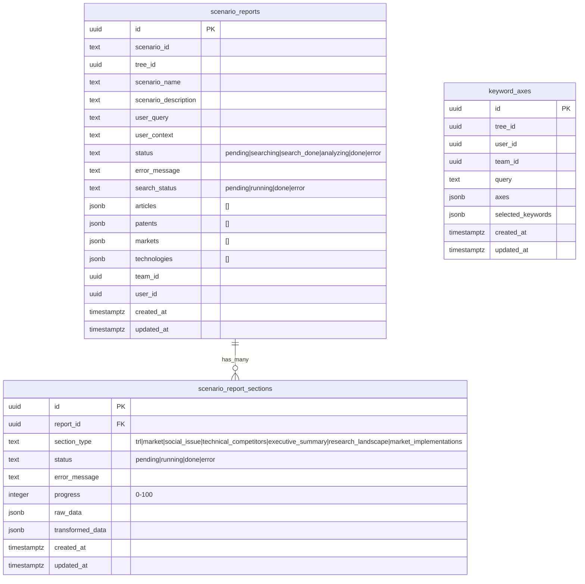
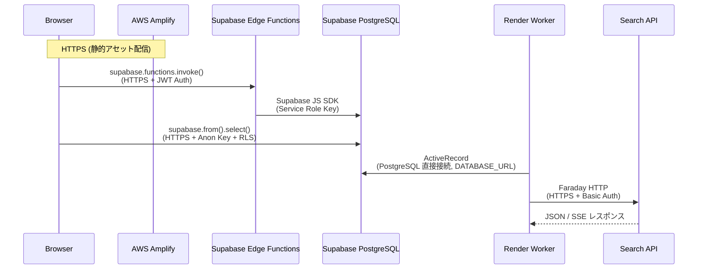

# Memory AI App — インフラストラクチャ概要

## 1. 全体アーキテクチャ



---

## 2. コンポーネント詳細

### 2.1 Frontend (Next.js 15 + React 18)

| 項目 | 詳細 |
|---|---|
| **フレームワーク** | Next.js 15.5.3 (App Router + React Router v6 SPA) |
| **UI** | shadcn/ui + Radix UI + Tailwind CSS 3.4 |
| **状態管理** | Zustand 5 (グローバル) + React Query 5 (サーバーステート) |
| **チャート** | Chart.js 4.5 + Recharts 2.12 |
| **テスト** | Jest 30.2 |
| **コード品質** | Biome 2.1 + ESLint + Husky pre-commit |
| **デプロイ先** | AWS Amplify |

**ルーティング構成:**

```text
/                     → Index (ツリー生成・検索)
/login                → 認証
/technology-tree      → メインツリー可視化
/search-results       → 検索結果表示
/research-context     → 研究コンテキスト
/scenario-selection   → シナリオ選択・レポート
/my-page              → ユーザーページ
/projects             → プロジェクト管理
/admin                → 管理者画面
/releases             → リリースノート
```

### 2.2 Supabase

| 項目 | 詳細 |
|---|---|
| **Project ID** | `mnnvcyrohovytovydaig` |
| **リージョン** | Supabase Cloud |
| **認証** | Supabase Auth (JWT, email/password) |
| **データベース** | PostgreSQL 15+ (Row Level Security 有効) |
| **Edge Functions** | 31 functions (Deno Runtime) |

### 2.3 Render Background Worker

| 項目 | 詳細 |
|---|---|
| **フレームワーク** | Rails 8.0 (API-only, Web サーバー起動なし) |
| **ジョブキュー** | GoodJob 4.0 (PostgreSQL-backed) |
| **HTTP クライアント** | Faraday 2.9 |
| **Ruby** | 3.3.0 |
| **プロセス** | `bundle exec good_job start` (worker のみ) |

### 2.4 Search API (Python)

| 項目 | 詳細 |
|---|---|
| **ホスト** | `search-api.stg.memoryai.jp` (staging) / `search-api.memoryai.jp` (prod) |
| **認証** | Basic Auth (`SEARCH_API_USER` / `SEARCH_API_PASS`) |
| **フレームワーク** | Python FastAPI (推定) |
| **プロトコル** | REST (JSON) + SSE (Server-Sent Events) |

---

## 3. データベーススキーマ

### 3.1 主要テーブル



### 3.2 GoodJob テーブル (Rails Worker 用)

Worker のジョブ管理用テーブル。Supabase PostgreSQL 内に Rails マイグレーションで作成。

| テーブル | 用途 |
|---|---|
| `good_jobs` | ジョブキュー (UUID PK, JSONB params, cron 管理) |
| `good_job_batches` | バッチジョブ管理 |
| `good_job_executions` | 実行履歴 |
| `good_job_processes` | ワーカープロセス管理 |
| `good_job_settings` | GoodJob 設定値 |

---

## 4. Edge Functions 一覧

### 4.1 ツリー生成系 (6 functions)

| 関数名 | 用途 | 外部 API |
|---|---|---|
| `generate-tree` | ツリー構造生成 (v1) | OpenAI |
| `generate-tree-v2` | ツリー構造生成 (v2) | OpenAI |
| `generate-tree-v3` | ツリー構造生成 (v3) | OpenAI |
| `generate-tree-fast` | 高速ツリー生成 (v1) | OpenAI |
| `generate-tree-fast-v2` | 高速ツリー生成 (v2) | OpenAI |
| `generate-tree-fast-v3` | 高速ツリー生成 (v3) | OpenAI |

### 4.2 ノードエンリッチメント系 (4 functions)

| 関数名 | 用途 | 外部 API |
|---|---|---|
| `node-enrichment` | エンリッチメントオーケストレーション | OpenAI |
| `node-enrichment-papers` | 論文エンリッチメント (v1) | OpenAI |
| `node-enrichment-papers-v2` | 論文エンリッチメント (v2) | OpenAI |
| `node-enrichment-usecases` | ユースケースエンリッチメント | OpenAI |

### 4.3 分析系 (2 functions)

| 関数名 | 用途 | 外部 API |
|---|---|---|
| `node-trl-calculation` | TRL (技術成熟度) 計算 | OpenAI |
| `paper-deep-analysis` | 論文深層分析 | OpenAI |

### 4.4 軸生成・TED 系 (3 functions)

| 関数名 | 用途 | 外部 API |
|---|---|---|
| `generate-axes` | 探索軸生成 | OpenAI |
| `generate-keywords-for-axis` | 軸キーワード生成 | OpenAI |
| `evaluate-ted-layer` | TED レイヤー評価 | OpenAI |
| `generate-ted-layer` | TED レイヤー生成 | OpenAI |

### 4.5 チャット系 (4 functions)

| 関数名 | 用途 | 外部 API |
|---|---|---|
| `chat-gpt` | 汎用 ChatGPT 統合 | OpenAI |
| `context-chat` | コンテキスト付きチャット | OpenAI |
| `scenario-chat` | シナリオ特化チャット | OpenAI |
| `research-context` | 研究コンテキスト生成 | OpenAI |

### 4.6 シナリオレポート系 (2 functions) — 薄型化済み

| 関数名 | 用途 | 外部 API |
|---|---|---|
| `scenario-report-generate` | DB insert + 202 返却 (Worker が処理) | なし |
| `scenario-report-section` | section status リセット (Worker が再処理) | なし |

### 4.7 管理・ユーティリティ系 (6 functions)

| 関数名 | 用途 |
|---|---|
| `admin-create-user` | ユーザー作成 |
| `admin-delete-user` | ユーザー削除 |
| `admin-reset-password` | パスワードリセット |
| `is-app-admin` | 管理者権限チェック |
| `duplicate-tree` | ツリー複製 |
| `api-health-check` | ヘルスチェック |

---

## 5. 環境変数

### 5.1 Supabase Edge Functions (Supabase Dashboard で管理)

| 変数 | 用途 |
|---|---|
| `SUPABASE_URL` | Supabase プロジェクト URL (自動設定) |
| `SUPABASE_SERVICE_ROLE_KEY` | サービスロールキー (自動設定) |
| `OPENAI_API_KEY` | OpenAI API キー |

### 5.2 Frontend (Amplify 環境変数)

| 変数 | 用途 |
|---|---|
| `NEXT_PUBLIC_SUPABASE_URL` | Supabase プロジェクト URL |
| `NEXT_PUBLIC_SUPABASE_ANON_KEY` | Supabase 匿名キー |

### 5.3 Render Background Worker

| 変数 | 用途 |
|---|---|
| `DATABASE_URL` | Supabase PostgreSQL 直接接続文字列 |
| `SEARCH_API_URL` | Search API ベース URL |
| `SEARCH_API_USER` | Search API Basic Auth ユーザー |
| `SEARCH_API_PASS` | Search API Basic Auth パスワード |
| `RAILS_ENV` | `production` |
| `SECRET_KEY_BASE` | Rails シークレットキー (auto-generated) |
| `RAILS_LOG_TO_STDOUT` | `1` |

---

## 6. 通信プロトコル



### 通信方式一覧

| From | To | プロトコル | 認証方式 |
|---|---|---|---|
| Browser | Amplify | HTTPS | なし (静的配信) |
| Browser | Supabase EF | HTTPS (REST) | JWT (Anon Key) |
| Browser | Supabase DB | HTTPS (PostgREST) | JWT (Anon Key) + RLS |
| Edge Function | Supabase DB | Supabase JS SDK | Service Role Key |
| Edge Function | OpenAI | HTTPS (REST) | Bearer Token |
| Worker | Supabase DB | PostgreSQL Wire Protocol | DATABASE_URL (SSL) |
| Worker | Search API | HTTPS (REST + SSE) | Basic Auth |

---

## 7. デプロイ構成

### 7.1 AWS Amplify (Frontend)

```yaml
# amplify.yml
preBuild: npm ci
build: npm run build
artifacts: .next/**/*
cache: node_modules/**/* , .next/cache/**/*
```

**トリガー:** Git push → Amplify 自動ビルド

### 7.2 Supabase Edge Functions

```bash
# 個別デプロイ
npx supabase functions deploy <function-name>

# 全関数デプロイ
npx supabase functions deploy
```

**注意:** プロダクション Edge Function に影響するため、デプロイ前に確認が必要。

### 7.3 Render Background Worker

```yaml
# render.yaml
type: worker
name: memory-ai-worker
runtime: ruby
rootDir: rails
buildCommand: bundle install
startCommand: bundle exec good_job start
preDeployCommand: bundle exec rails db:migrate
```

**トリガー:** Git push → Render 自動ビルド・デプロイ
