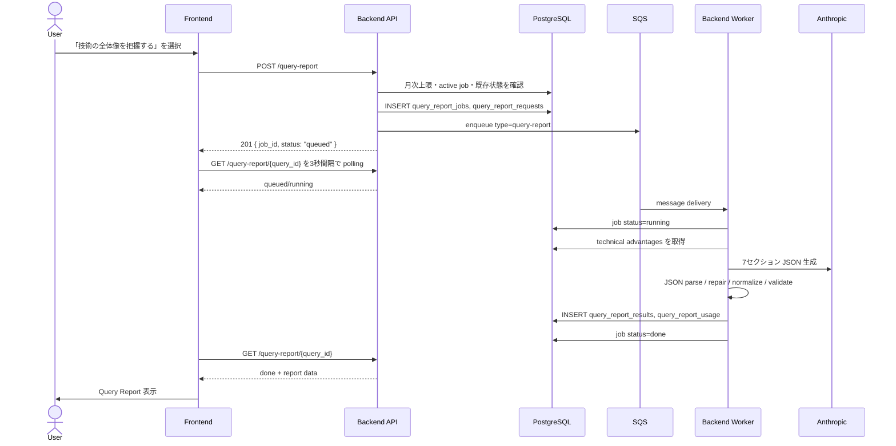

# Query Report Generation — 仕様・設計書

## 1. 目的

Query Report Generation は、ユーザーが入力した技術クエリを起点に、技術ランドスケープの全体像を 7 セクションのレポートとして生成・表示する機能である。

本機能は以下を満たすことを目的とする。

- クエリ単位で AI 生成レポートを非同期に生成する。
- 生成中・完了・失敗の状態をフロントエンドからポーリングできる。
- 同一ユーザー・同一クエリで同時に複数の生成ジョブが走らないようにする。
- 生成済みレポートは再利用し、不要な再生成を避ける。
- LLM 生成結果が一部疎な場合でも、可能な範囲で画面表示できるように正規化する。
- 新規 API エンドポイント追加時に、OpenAPI と Terraform 側の公開経路設定を漏らさない。

## 2. 対象スコープ

対象:

- フロントエンドの Query Report 生成・ポーリング・表示
- Backend API の `/query-report` 系エンドポイント
- SQS を使った非同期実行
- Query Report 用 DB テーブル
- Anthropic による 7 セクション JSON レポート生成
- 月次生成上限
- エラー時のユーザー向け表示

対象外:

- Scenario Report の生成仕様
- 技術ツリー生成そのもの
- Terraform 実装ファイルの詳細。ただし、本書に Terraform 側で必要な反映項目を明記する

## 3. 用語

| 用語 | 意味 |
|---|---|
| query | ユーザーが入力した技術テーマ |
| query_id | クエリを識別する UUID |
| query report | 技術ランドスケープ全体像レポート |
| job | Query Report 生成の非同期実行単位 |
| technical advantages | クエリに紐づく技術的強み。レポート生成時の補助入力 |
| active job | `queued` または `running` 状態の job |

## 4. ユーザーフロー



## 5. レポート構成

生成される Query Report は以下の 7 セクションで構成される。

| セクション | 表示名 | 主な内容 |
|---|---|---|
| `s01` | Background | KPI、背景、市場・政策の概観 |
| `s02` | Definition & Role | 技術の定義、役割、技術的強み |
| `s03` | Market Size | TAM、市場カード、予測、出典 |
| `s04` | Technology Timeline | 論文・特許推移、イベント、代表論文、特許 |
| `s05` | Technology Structure | スコープ定義、原理軸、原理マップ、TRL、技術分類 |
| `s06` | Challenges | 技術・事業・規制などの課題 |
| `s07` | Public Support | 支援制度・補助金・公的プログラム |

フロントエンドの表示型は `src/types/query-report.ts` を single source of truth とする。

## 6. API 仕様

OpenAPI 定義は `be/src/docs/openapi.ts` に記載する。

### 6.1 POST `/query-report`

Query Report 生成 job を作成し、SQS に投入する。

認証:

- `requireAuth` 必須
- `x-user-id` ベースの user id を使用

Request:

```json
{
  "query_id": "123e4567-e89b-12d3-a456-426614174000",
  "query": "Solid-State Batteries",
  "language": "Japanese",
  "technicalAdvantages": [
    {
      "strengthName": "High energy density",
      "description": "Enables compact batteries with higher capacity.",
      "potentialApplications": "EVs, grid storage"
    }
  ]
}
```

`technicalAdvantages` は後方互換のため受け付けるが、生成パイプラインでは DB に保存済みの technical advantages を優先する。DB 側に存在しない場合のみ fallback として扱う。

Response:

| Status | 意味 |
|---|---|
| `201` | job 作成・キュー投入成功 |
| `400` | request body 不正 |
| `409` | 同一 user/query の active job が存在 |
| `429` | 月次上限超過 |
| `500` | サーバー内部エラー |

Success response:

```json
{
  "job_id": "abc12345-0000-0000-0000-000000000001",
  "status": "queued"
}
```

### 6.2 GET `/query-report/{query_id}`

Query Report の状態を取得する。フロントエンドは 3 秒間隔で polling する。

認証:

- `requireAuth` 必須
- DB 参照は `query_id` と `user_id` の両方で絞り込む

Path parameter:

| Name | Type | Validation |
|---|---|---|
| `query_id` | UUID string | `z.string().uuid()` |

Response status:

| status | 意味 | data |
|---|---|---|
| `queued` | job は作成済みで worker 処理待ち | `{}` |
| `running` | worker が生成中 | `{}` |
| `done` | 生成完了 | QueryReportData |
| `failed` | 最後の job が失敗 | `{}` |
| `not_found` | job も result も存在しない | `{}` |

失敗時の `message` / `progress` はユーザー向けに sanitize した文言のみ返す。LLM API の詳細、内部 path、stack trace などは client に返さず、server log にのみ残す。

## 7. Backend 設計

### 7.1 Controller

実装:

- `be/src/controllers/queryReport.ts`

責務:

- request body validation
- 月次上限チェック
- active job の確認
- race condition 対策として DB unique constraint 違反を `409` に変換
- job/request の保存
- SQS enqueue
- polling response の構築

Controller では重い LLM 生成処理を実行しない。生成処理は SQS 経由で worker が実行する。

### 7.2 Queue / Worker

実装:

- `be/src/queue/index.ts`
- `be/src/worker/queryReportPipeline.ts`

Queue message:

```json
{
  "type": "query-report",
  "jobId": "abc12345-0000-0000-0000-000000000001",
  "queryId": "123e4567-e89b-12d3-a456-426614174000",
  "query": "Solid-State Batteries",
  "language": "Japanese",
  "userId": "bd0331d4-15df-4446-a295-fd471c975339"
}
```

同じ queue は scenario report でも利用する。`type` が `query-report` の場合は `runQueryReportPipeline`、それ以外または `scenario-report` の場合は `runScenarioReportPipeline` に dispatch する。既存の type 無し scenario message は scenario report として扱う。

SQS を利用する理由:

- API request process から長時間 LLM 生成を切り離す
- deploy / crash / restart 時に SQS visibility timeout 後の redelivery で再実行できる
- scenario report と同じ非同期実行モデルに揃える

### 7.3 Pipeline

主な処理:

1. `query_report_jobs.status = running`, `progress = step:generate`
2. DB から technical advantages を取得
3. Anthropic に 7 セクション JSON 生成を依頼
4. JSON parse 失敗時は repair prompt で JSON 修復
5. `normalizeQueryReport` で欠損 field を補完
6. `validateQueryReportSchema` で最低限の shape を検証
7. `query_report_results` に保存
8. `query_report_usage` に token / cost を保存
9. `query_report_jobs.status = done`

失敗時:

1. server log に raw error を記録
2. `query_report_jobs.status = failed`
3. `progress = "Report generation failed. Please try again."`
4. error を再 throw し、SQS message は削除せず redelivery 対象にする

## 8. DB 設計

Migration:

- `be/src/db/migrations/0004_add_query_report_tables.sql`

### 8.1 `query_report_jobs`

Job の主テーブル。

| Column | Type | Description |
|---|---|---|
| `id` | uuid | job id |
| `status` | text | `queued` / `running` / `done` / `failed` |
| `progress` | text | 現在 step または user-facing failure message |
| `retry_count` | integer | retry 回数用 |
| `user_id` | uuid | user id |
| `query_id` | uuid | query id |
| `created_at` | timestamptz | 作成時刻 |
| `updated_at` | timestamptz | 更新時刻 |

重要 constraint / index:

- `query_report_jobs_status_check`
- `idx_query_report_jobs_query_id`
- `idx_query_report_jobs_status`
- `idx_query_report_jobs_user_created`
- `uniq_query_report_active_job`

`uniq_query_report_active_job` は `(query_id, user_id)` に対する partial unique index で、`status IN ('queued', 'running')` の job を同時に複数作れないようにする。

### 8.2 `query_report_requests`

生成 request の input payload を保存する監査用テーブル。

### 8.3 `query_report_results`

正規化・検証済みの `result_json` を保存する。

### 8.4 `query_report_usage`

LLM token usage と cost を保存する。

## 9. 正規化・Validation 方針

Query Report は LLM 生成結果を扱うため、厳格すぎる validation で全体を失敗させない方針とする。

方針:

- section 自体は必須
- 表示に必要な object / array field は `normalizeQueryReport` で default を補う
- nested object は deep merge し、partial response でも default field を落とさない
- `sources`, `kpis`, `forecasts`, `events`, `challenges`, `technologies` などは empty array を許容する
- `trlDefs.length === 9` や `technologies[].trlDist.length === 9` は hard failure 条件にしない
- UI component 側は empty array を表示可能な状態として扱う

この方針により、LLM が一部 field を省略しても生成 job 全体を失敗させず、生成できた範囲を表示する。

## 10. 月次上限

実装:

- `be/src/services/queryReportService/queryReportLimitService.ts`

Query Report の月次上限は `status = done` の job のみを count する。

理由:

- active job は `uniq_query_report_active_job` で別途制御する
- failed job はユーザーが成果物を得ていないため quota 消費にしない
- queued / running を quota に含めると、クラッシュや失敗時にユーザーが slot を失う

## 11. Frontend 設計

主な実装:

- `src/services/queryReportApiService.ts`
- `src/hooks/useQueryReport.ts`
- `src/routes/QueryReportPreview.tsx`
- `src/components/scenario/report/query/QueryReportView.tsx`
- `src/components/scenario/report/query/QueryReportHeader.tsx`

Polling:

- `useQueryReport` が `/query-report/{query_id}` を 3 秒間隔で polling
- `done` で polling 停止
- `queued` / `running` は loading 表示
- `failed` は user-facing message を表示
- unmount / query change 時は `AbortController` で request を中断

Query Report から scenario exploration へ遷移する場合:

- 既存 scenario がある場合は scenario selection page へ直接遷移
- 既存 scenario がない場合は technical strengths modal を表示し、confirm 後に scenario 生成へ進む

## 12. Security / Access Control

- 全 API は `requireAuth` 必須
- DB query は `query_id` と `user_id` の両方で絞り込む
- malformed UUID は DB に渡す前に `400` にする
- raw error は client に返さない
- 生成 prompt の補助情報は DB の technical advantages を優先する

## 13. 運用・監視

最低限確認すべき log:

- `queryReport::POST::received`
- `queryReport::POST::job created`
- `queue::enqueueQueryReportJob::sent`
- `queue::poll::processing message`
- `queryReportPipeline::runQueryReportPipeline::started`
- `queryReportPipeline::runQueryReportPipeline::done`
- `queryReportPipeline::runQueryReportPipeline::failed`

監視観点:

- `query_report_jobs.status = failed` の増加
- `queued` / `running` の滞留
- Anthropic rate limit / server error
- SQS visible / not visible message count
- token cost の急増

## 14. Terraform / Infrastructure 反映事項

このリポジトリ内には Terraform ファイルが存在しないため、Terraform の実装差分は別管理の可能性がある。新規 Backend API endpoint を追加・公開する場合、Terraform 側では以下を確認・反映すること。

### 14.1 API 公開経路

Backend が ALB / API Gateway / CloudFront 経由で path allowlist を持つ場合、以下を許可する。

- `POST /query-report`
- `GET /query-report/{id}`

既存設定が Backend service への catch-all proxy の場合は追加不要。ただし path-based routing / WAF / authorizer / CORS を個別定義している場合は追加が必要。

### 14.2 CORS

Frontend origin から以下 method/header が許可されていること。

- Methods: `GET`, `POST`, `OPTIONS`
- Headers: `Content-Type`, auth/user id headers, source IP forwarding headers

### 14.3 SQS

Query Report は scenario report と同じ queue を利用する。

確認項目:

- Backend task role が `sqs:SendMessage`, `sqs:ReceiveMessage`, `sqs:DeleteMessage` を持つ
- `SQS_QUEUE_URL` が Backend service / worker に設定されている
- FIFO queue の場合、`MessageGroupId` が利用可能
- visibility timeout が LLM 生成時間より短すぎない
- DLQ / maxReceiveCount の設定がある場合、failed job の運用手順がある

### 14.4 Environment Variables

Backend / migrate task で必要な env が設定されていること。

- `DATABASE_URL` または RDS 接続設定
- `AWS_REGION`
- `SQS_QUEUE_URL`
- `ANTHROPIC_API_KEY`
- `FREE_MONTHLY_REPORT_LIMIT`
- `UNLIMITED_USER_IDS`
- `APP_ENV`

### 14.5 DB Migration

STG / Prod deploy で `0004_add_query_report_tables.sql` が実行されること。

確認 SQL:

```sql
SELECT to_regclass('public.query_report_jobs');
SELECT to_regclass('public.query_report_results');
SELECT to_regclass('public.query_report_requests');
SELECT to_regclass('public.query_report_usage');
```

Partial unique index:

```sql
SELECT indexname, indexdef
FROM pg_indexes
WHERE indexname = 'uniq_query_report_active_job';
```

## 15. リリース前チェックリスト

- [ ] `be/src/docs/openapi.ts` に `/query-report` と `/query-report/{id}` が記載されている
- [ ] Terraform 側で新規 endpoint path が公開されている、または catch-all proxy で追加不要と確認済み
- [ ] Terraform 側で CORS / WAF / authorizer の対象 path が更新済み
- [ ] Backend task role が SQS 操作権限を持つ
- [ ] Backend env に `SQS_QUEUE_URL` / `ANTHROPIC_API_KEY` が設定済み
- [ ] DB migration が STG で適用され、query report tables と partial unique index が存在する
- [ ] `POST /query-report` が `201` を返す
- [ ] `GET /query-report/{query_id}` が `queued` / `running` / `done` / `failed` を返せる
- [ ] 生成失敗時に raw error が client に返らない
- [ ] 同時 POST 時に片方が `409` になる
- [ ] 生成済みレポートが UI で再表示できる

## 16. 関連ファイル

| 領域 | ファイル |
|---|---|
| Backend controller | `be/src/controllers/queryReport.ts` |
| Queue | `be/src/queue/index.ts` |
| Pipeline | `be/src/worker/queryReportPipeline.ts` |
| Validation | `be/src/worker/queryReportValidate.ts` |
| Prompt / Anthropic | `be/src/services/queryReportService/prompt.ts`, `be/src/services/queryReportService/index.ts` |
| Limit | `be/src/services/queryReportService/queryReportLimitService.ts` |
| DB schema | `be/src/db/schema/queryReport*.ts` |
| Migration | `be/src/db/migrations/0004_add_query_report_tables.sql` |
| OpenAPI | `be/src/docs/openapi.ts` |
| Frontend API | `src/services/queryReportApiService.ts` |
| Polling hook | `src/hooks/useQueryReport.ts` |
| Page | `src/routes/QueryReportPreview.tsx` |
| Viewer | `src/components/scenario/report/query/QueryReportView.tsx` |
| Data type | `src/types/query-report.ts` |
