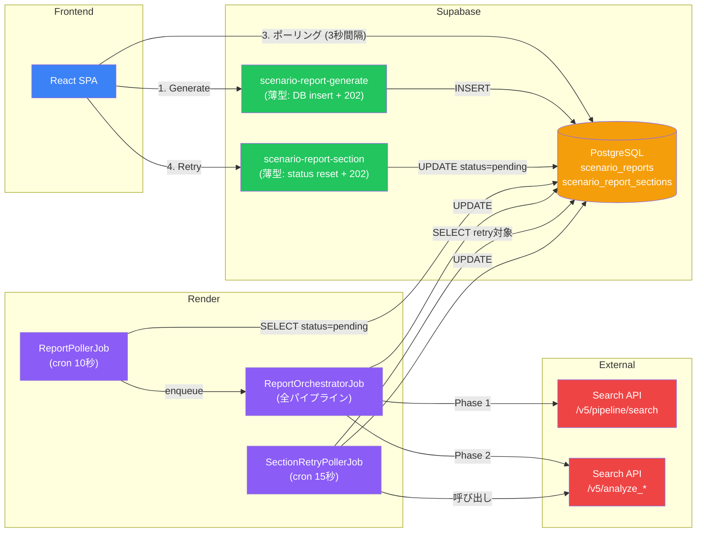
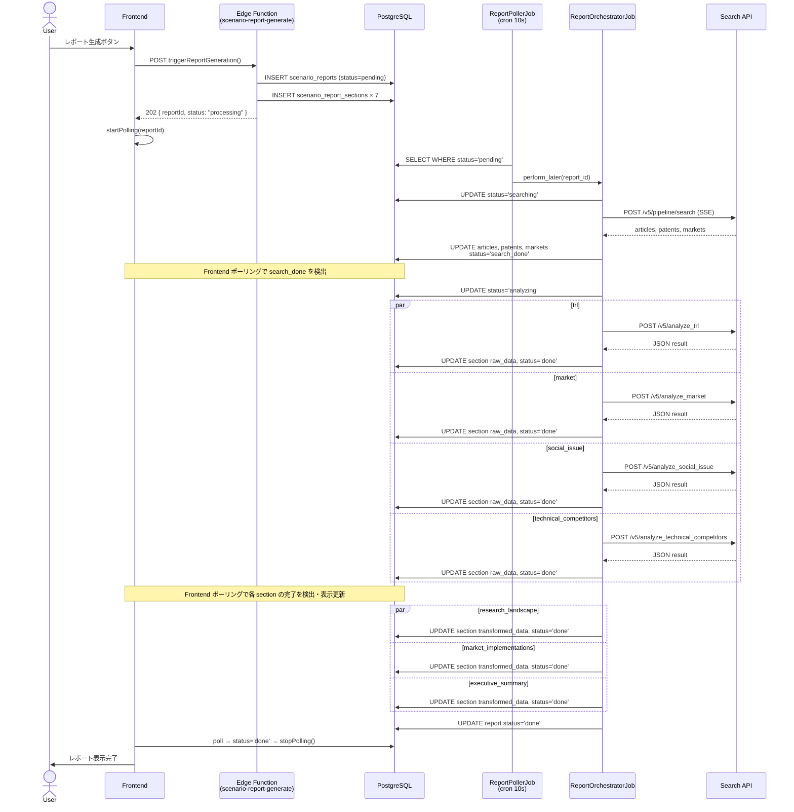
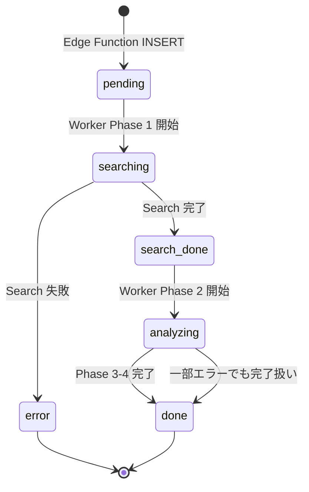
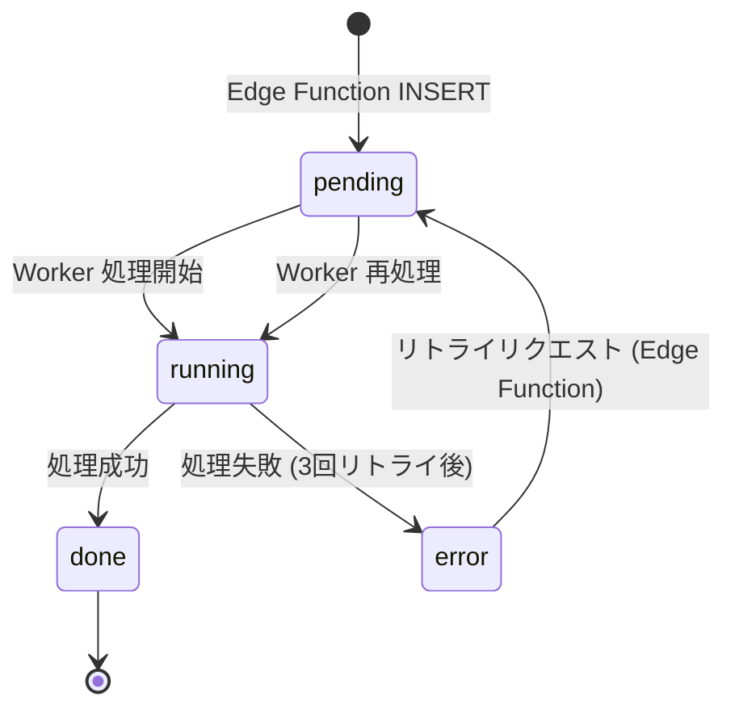
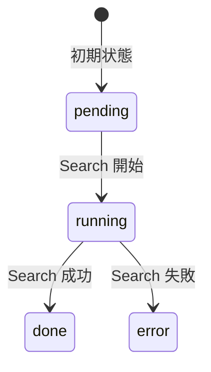
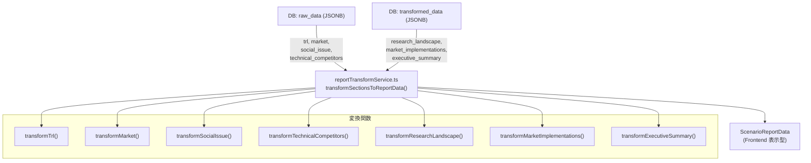
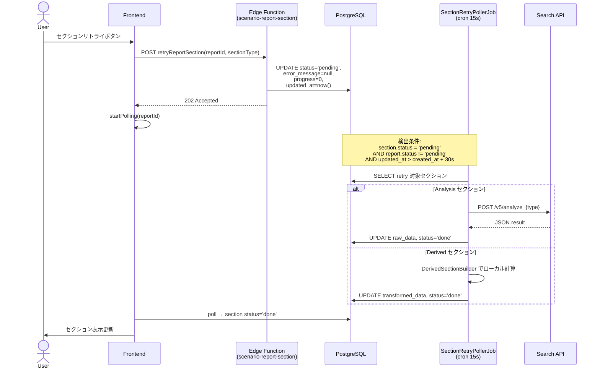

# シナリオレポート生成パイプライン — 詳細設計

## 1. アーキテクチャ概要

Edge Function を**薄型化** (DB insert のみ) し、重い処理を **Render Background Worker (Rails + GoodJob)** で実行するアーキテクチャ。



---

## 2. 処理フロー (時系列)



---

## 3. ステータス遷移

### 3.1 scenario_reports.status



### 3.2 scenario_report_sections.status



### 3.3 scenario_reports.search_status



---

## 4. セクション詳細

### 4.1 Analysis Sections (外部 API 呼び出し)

| セクション | API エンドポイント | タイムアウト | 格納先 | リトライ |
|---|---|---|---|---|
| `trl` | `POST /v5/analyze_trl` | 900s | `raw_data` | 3回 |
| `market` | `POST /v5/analyze_market` | 900s | `raw_data` | 3回 |
| `social_issue` | `POST /v5/analyze_social_issue` | 900s | `raw_data` | 3回 |
| `technical_competitors` | `POST /v5/analyze_technical_competitors` | 900s | `raw_data` | 3回 |

### 4.2 Derived Sections (ローカル計算)

| セクション | データソース | 格納先 | 処理時間 |
|---|---|---|---|
| `research_landscape` | `report.articles` + `report.patents` | `transformed_data` | < 1s |
| `market_implementations` | `report.markets` | `transformed_data` | < 1s |
| `executive_summary` | Analysis セクションの `raw_data` + search 結果 | `transformed_data` | < 1s |

---

## 5. データ構造

### 5.1 Analysis セクション → `raw_data` の構造

各 `/v5/analyze_*` エンドポイントからの JSON レスポンスがそのまま格納される。

**TRL (`raw_data`):**

```json
{
  "raw": {
    "report": {
      "technologies": [
        {
          "technology_name": "...",
          "integrated_trl": 7,
          "feasibility_assessment": "...",
          "integrated_reasoning": "..."
        }
      ],
      "final_summary": "..."
    }
  },
  "table": {
    "rows": [
      {
        "technology_name": "...",
        "integrated_trl": 7,
        "article_trl": 6,
        "patent_trl": 8,
        "market_trl": 7,
        "feasibility_assessment": "...",
        "integrated_reasoning": "..."
      }
    ]
  }
}
```

**Market (`raw_data`):**

```json
{
  "data": {
    "tam_value": "1.2兆円",
    "sam_value": "3,000億円",
    "cagr": "12.5%",
    "summary": "...",
    "segments": [
      {
        "segment_name": "...",
        "share_percent": 35,
        "estimated_size": "4,200億円"
      }
    ]
  }
}
```

**Social Issue (`raw_data`):**

```json
{
  "raw": {
    "solutions": [
      {
        "title": "...",
        "issue_title": "...",
        "reason_annotated": "...",
        "cited_sources": [
          { "url": "...", "title": "..." }
        ]
      }
    ]
  }
}
```

**Technical Competitors (`raw_data`):**

```json
[
  {
    "technology_name": "...",
    "table": {
      "unique_companies": 15,
      "analyzed_companies": 10,
      "rows": [
        {
          "rank": 1,
          "company_name": "...",
          "country": "JP",
          "patent_count": 42
        }
      ]
    }
  }
]
```

### 5.2 Derived セクション → `transformed_data` の構造

**Research Landscape:**

```json
{
  "articleCommentary": "45件の論文が見つかりました。",
  "articleYearlyData": [
    { "year": 2020, "count": 5 },
    { "year": 2021, "count": 12 }
  ],
  "patentCommentary": "23件の特許が見つかりました。",
  "patentYearlyData": [
    { "year": 2020, "count": 3 }
  ],
  "topJournals": [
    { "name": "Nature", "count": 8 }
  ]
}
```

**Market Implementations:**

```json
[
  {
    "product": "製品名",
    "company": "企業名",
    "stage": "commercial",
    "description": "...",
    "urls": ["https://..."],
    "year": 2024
  }
]
```

**Executive Summary:**

```json
{
  "narrative": "分析結果の要約テキスト...",
  "findings": ["発見1", "発見2"],
  "marketRows": [
    { "index": 1, "label": "TAM", "value": "1.2兆円" }
  ],
  "researchRows": [
    { "index": 1, "label": "論文数", "value": "45件" }
  ]
}
```

---

## 6. Frontend データ変換フロー



---

## 7. リトライフロー



---

## 8. Worker ジョブ構成

### 8.1 GoodJob 設定

```ruby
# config/initializers/good_job.rb
config.good_job.execution_mode = :external     # Worker プロセスのみ
config.good_job.poll_interval  = 5             # 5秒ごとにジョブキュー確認
config.good_job.max_threads    = 3             # 最大 3 並行ジョブ
config.good_job.shutdown_timeout = 60          # graceful shutdown

config.good_job.cron = {
  report_poller:        { cron: "*/10 * * * * *", class: "ReportPollerJob" },
  section_retry_poller: { cron: "*/15 * * * * *", class: "SectionRetryPollerJob" }
}
```

### 8.2 ジョブ一覧

| ジョブ | トリガー | 処理内容 | 重複防止 |
|---|---|---|---|
| `ReportPollerJob` | cron (10秒) | pending レポート検出 → Orchestrator enqueue | - |
| `ReportOrchestratorJob` | ReportPollerJob からの enqueue | 全パイプライン実行 (Search → Analyze × 4 → Derived × 3 → Finalize) | GoodJob Concurrency (total_limit: 1, key: report_id) |
| `SectionRetryPollerJob` | cron (15秒) | retry 対象セクション検出 → 個別再処理 | - |

### 8.3 DB 接続プール

```yaml
# config/database.yml
pool: 15  # GoodJob(3) + Analysis並列(4) + Derived並列(3) + margin(5)
```

Analysis/Derived の並列スレッドは `ActiveRecord::Base.connection_pool.with_connection` で明示的に接続管理。

---

## 9. Search API エンドポイント

### 9.1 Search Pipeline

```text
POST /v5/pipeline/search
Content-Type: application/json
Authorization: Basic <base64>

Request Body:
{
  "scenario": {
    "user_query": "...",
    "user_context": "...",
    "scenario_name": "...",
    "scenario_description": "..."
  },
  "technologies": [
    { "tech_name": "...", "tech_definition": "..." }
  ],
  "language": "Japanese"
}

Response: SSE stream
  data: {"type": "progress", "phase": "...", "progress": 50, ...}
  data: {"type": "result", "data": {"articles": [...], "patents": [...], "markets": [...]}}
```

**タイムアウト:** 600 秒 (10 分)

### 9.2 Analyze Endpoints

```text
POST /v5/analyze_{trl|market|social_issue|technical_competitors}
Content-Type: application/json
Authorization: Basic <base64>

Request Body:
{
  "scenario": { ... },
  "technologies": [...],
  "articles": [...],
  "patents": [...],
  "markets": [...],
  "language": "Japanese"
}

Response: JSON (セクション固有の構造)
```

**タイムアウト:** 900 秒 (15 分)

---

## 10. ファイル構成

```text
rails/
├── Gemfile                              # Ruby 依存関係
├── Procfile                             # Render: worker: bundle exec good_job start
├── Rakefile
├── config.ru
├── .ruby-version                        # 3.3.0
├── app/
│   ├── models/
│   │   ├── application_record.rb
│   │   ├── scenario_report.rb           # 既存テーブルマッピング
│   │   └── scenario_report_section.rb   # 既存テーブルマッピング
│   ├── services/
│   │   ├── search_api_client.rb         # Search API HTTP クライアント
│   │   ├── sse_consumer.rb              # SSE レスポンスパーサー
│   │   └── derived_section_builder.rb   # Derived セクション計算
│   └── jobs/
│       ├── application_job.rb
│       ├── report_poller_job.rb          # cron: pending レポート検出
│       ├── report_orchestrator_job.rb    # 全パイプライン実行
│       └── section_retry_poller_job.rb   # cron: retry セクション検出
├── config/
│   ├── application.rb                    # Rails 8 API-only
│   ├── boot.rb
│   ├── database.yml                      # DATABASE_URL, pool: 15
│   ├── environment.rb
│   ├── routes.rb                         # 空 (Worker のみ)
│   ├── environments/
│   │   ├── production.rb
│   │   └── development.rb
│   └── initializers/
│       ├── good_job.rb                   # GoodJob + cron 設定
│       └── secret_key_base.rb
└── db/
    └── migrate/
        └── 20260301000001_create_good_jobs.rb  # GoodJob テーブル
```
